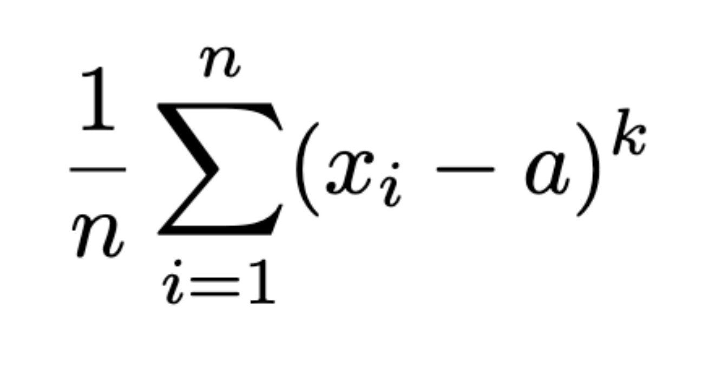

# Computer Science II
## Lab 6.0 - Classes & Constructors

An introduction to using polymorphism in the Java programming language.

This is a lab used in Computer Science II (CSCE 156, CSCE 156H) in the [Department of Computer Science & Engineering](https://cse.unl.edu) at the [University of Nebraska-Lincoln](https://unl.edu).

## Overview

### Resources

Prior to lab you should read/review the following resources.

-   Read the Oracle tutorial on Sub-type Polymorphism  
    <http://docs.oracle.com/javase/tutorial/java/IandI/polymorphism.html>

-   Read the Oracle tutorial on Method Overloading in Java  
    <http://docs.oracle.com/javase/tutorial/java/javaOO/methods.html>

-   Read the Oracle tutorial on Java Generics  
    <http://docs.oracle.com/javase/tutorial/java/IandI/createinterface.html>

### Lab Objectives & Topics

Following the lab, you should:

-   Understand and be able to use various forms of polymorphism
    including sub-type polymorphism, method overloading, and
    parameterized polymorphism

-   Understand and be able to use method overloading and generics in
    Java
    
### Peer Programming Pair-Up

To encourage collaboration and a team environment, labs will be
structured in a *pair programming* setup.  At the start of
each lab, you may be randomly paired up with another student by
a lab instructor.  One of you will be designated the *driver* 
and the other the *navigator*.  

The navigator will be responsible for reading the instructions 
and telling the driver what is to be done.  The driver will be 
in charge of the keyboard and workstation.  Both driver and 
navigator are responsible for suggesting fixes and solutions 
*together*.  Neither the navigator nor the driver is "in charge."  
Beyond your immediate pairing, you are encouraged to help and 
interact and with other pairs in the lab.

Each week you should try to alternate: if you were a driver 
last week, be a navigator next, etc.  Resolve any issues (you 
were both drivers last week) within your pair.  Ask the lab 
instructor to resolve issues only when you cannot come to a 
consensus.  

Because of the peer programming setup of labs, it is absolutely 
essential that you complete any pre-lab activities and familiarize
yourself with the handouts prior to coming to lab.  Failure to do
so will negatively impact your ability to collaborate and work with 
others which may mean that you will not be able to complete the
lab.  

## 1. Getting Started

Clone this project code for this lab from GitHub in Eclipse using the
URL: https://github.com/cbourke/CSCE156-Lab06. Refer to Lab 1.0 for
instructions on how to clone a project from GitHub.

## 2. Polymorphism

Polymorphism is the ability for variables, methods, and classes to take
on different forms (types) at different points in the execution of a
program. Polymorphism can take on various forms and allows us to write
more general code that can be applied to different types of variables
and classes.

The classical form of polymorphism is subtype polymorphism where you can
treat a type *T* as its super type *S* but the subtype retains its
methods and behavior. Typically this is done so that code that can be
written generally enough to be applied to type *S* can be applied to any
subtype of *S*.

## 2.1 Method Overloading

One simple type of polymorphism is method (or function) overloading.
This is where several versions of a method can be defined with the same
name, possibly different return types, but with different parameters.
Parameters may differ either in type or in arity (a different *number* of
parameters).

One example can be found in Java’s `Math` class, which contains four
different absolute value methods but all with the same name, `abs()`. Each of
the four methods takes a single argument, but differ in the type of
variable they take: `double`, `float`, `int`, and `long`. Contrast this 
with a language such as C that doesn’t support function overloading. 
In the C language, there are several different absolute value functions 
all with different names (`abs()`, `fabs()`, `labs()`, etc.).

Method overloading allows us to define several methods with the same
name so that when we invoke the method we only need to use one method
name. Which method is actually invoked is determined at compile time
through static dispatch. Depending on the number and types of parameters
we provide when we call the method, the compiler is able to determine
which version of the function was intended.

## 2.2 Parameterized Polymorphism

Parametric polymorphism is when code is written without a specific type
and instead can be applied to any type or types. Typically, the
arguments that you provide to a method or variable declarations within a
method have a fixed type (`int`, `double`, `String`, etc.). However, often code can be
written generically as it doesn’t depend on any particular property of
the types that it is applied to.

As an example, consider a `getMax()` method applied to a collection of integers,
doubles, or Strings which returns the maximal value in each of the lists
(numerically or lexicographically). Without parameterized polymorphism
we would need to write 3 different methods even though the logic of the
code would be the same (save perhaps for the way comparisons are made).
As a better alternative, we could write one method, which could be
applied to any collection of a generic type `T`. Here, `T` serves as a
parameterized *type*–you provide the method with a collection of objects
of type `T` and it will find the maximum among them and return it.

Of course, we may need a minimal amount of information about the type `T`.
In this particular case, we would need to know how to compare objects of
type `T` with each other in order to find the maximum. This introduces the
need for *bounded* parameterized polymorphism. In the context of the `getMax()`
method, we would need to know that objects of type `T` are (in some way)
comparable to each other and how to compare them.

Another context in which we would bound a parameterization is when we
only want objects of a particular type that are also a subclass of some
other class. For example, numerical methods such as a sum or average
method could be made generic, but could be bounded to specify that the
type must also be a subclass of a `Number`.

## 3. Activities 

In the following activities you will explore polymorphism in the Java
programming language. Specifically, you will learn to define, apply and
use overloaded methods and generic types.

### 3.1 Method Overloading

A *moment* is a statistical measure of the "shape" of a set of points.
That is, it measures how a distribution deviates from a point. Formally,
the $k$-th moment of a set of points $x_1, \ldots, x_n$ is defined as
follows.  
<p align="center">

</p>  

Where $\alpha$ is a real number and $k > 0$ is an integer. This is the
most general form of the formula with $\alpha$ and $k$ provided as
parameters. Otherwise, the "default" values for each are 0 and 1
respectively.

You may recognize several special cases of the moment: for
$\alpha = 0, k = 1$ this is the sample mean.  For $\alpha$ being the
mean, and $k = 2$, this is the definition of variance.

1.  Open the `MomentStats.java` file.

2.  Define and implement 4 static methods that compute the moment. All
    of them should take a `List` of `Double` values, but they should differ as
    follows.

    -   One that takes only $\alpha$ as a parameter

    -   One that takes only $k$ as a parameter

    -   One that takes both $\alpha$ and $k$

    -   One that takes neither

    In the cases where a parameter is not provided, use the default(s)
    mentioned above.

3.  In the `main()` method, call the methods you wrote with the provided list of
    `double` values.

### 3.2 Using Parameterized Classes

The Java collections framework extensively uses parameterized types to
define generic data structures that can hold collections of similar
objects. You are likely familiar with the `List` and `Set` interfaces already. These
can be parameterized to hold a single type of object.

Another useful data structure is a `Map<K,V>`, which associates a key object (of
type `K`) to a value object (of type `V`). The parameterization ensures that
only objects of type `K` can be used as a key and only objects of type `V` can
be used as values in the map. Key-value pairs can be placed into the map
using the method `put()` and can be retrieved using the `get()` method.

In this exercise, you will familiarize yourself with maps by using one
to compute the multiplicity of a list of integers and subsequently to
find the mode of the list. Recall that the multiplicity of a number $x$
in a list of integers is the number of times it appears in the list. The
mode of a list of numbers is the value (or values) that appears the
most.

1.  Open the `ModeDemo.java` file.

2.  You will find several methods already completed for you. You need to
    implement the `computeMultiplicities()` and `findModes()` methods. 
    Refer to the comments on how to use the `Map` data structure. Note that 
    `Map` is an interface. `HashMap` is a common implementation of this interface.

### 3.3 Creating Parameterized Classes

In this activity you will explore how to parameterize classes in Java
using generics, and observe the consequences of not parameterizing.
Generics were introduced in Java 5. Prior to that (and for backwards
compatibility), Java used *raw types*. Collections such as `List` and `Set`
could hold *any* type of Java `Object`. The syntax for parameterizing a java
class is to include a `<T>` in its declaration:

```java
public class Foo <T> {
  ...
}
```

Once parameterized, the type `T` can now be used in the body of the class,
which will take on whatever type instances of `Foo` are instantiated with.
Once a parameterized class has been defined, the following syntax can be
used to instantiate an instance of `Foo` parameterized with an integer type:

`Foo<Integer> bar = new Foo<Integer>()`

Parameters can be *bounded* using the `extends` keyword. For example 
`<T extends Bar>` will match any type `T`, but `T` *must* be a subclass of 
`Bar`.

When you use a variable to represent your type, this is known as a
*named parameter* and is used when you need to refer to the type (such
as when you declare a variable, method parameter, or method return type
that needs to match `T`). However, if you don’t need to refer to the type,
it is better to use the wildcard, `?` instead of a specific type. The
wildcard matches any type and can still be used in conjunction with the
`extends` keyword to specify "any type that is a subtype of `Bar`" (using 
the syntax `<? extends Bar>`).

It is also possible to use generics of generics. For example, the
following creates an `ArrayList` that is parameterized to only hold objects 
of type `Foo` that have themselves been parameterized with a `Double`:

`List<Foo<Double>> baz = new ArrayList<Foo<Double>>();`

Several classes have been provided in the project to model `Undergraduate` 
students, `Graduate` students (both of which are subclasses of `Student`), 
and `Droid` (which are not students). Also included are `Course`s, which 
may have `Section`(s). These classes are
intended to model an enrollment system based on the following rules:

-   Each `Section` should only hold student types and each `Section` 
    should only consist of one type of `Student`. Grads and undergrads 
    should not be able to enroll in the same section.

-   Each `Course` should be able to hold any number of sections, but those
    sections should conform to the previous rules.

Follow the instructions below to parameterize your classes to conform to
these rules and to understand the implications of not parameterizing
your classes.

### 3.3.1. Parameterizing a class

1.  Open the `CourseDemo`, `Course`, and `Section` class files. Two 
    instances of each entity (`Undergraduate`, `Gradaute`, `Droid`) 
    have been created for you (feel free to modify or add if you wish).

2.  In the `CourseDemo` class create a `Section` and enroll all 6 
    instances to this section.

**Problem**: Observe that since the `Section` class is not parameterized 
(it uses raw types) we are able to add any of these three types into the same
section, violating rule 1 above.

**Solution**: Parameterize the `Section` class so that each section can only hold
one type of object. Update the rest of the `Section` class to use this type as
needed. Observe that in `CourseDemo` the code you wrote should now be giving you
warnings: the `Section` class is now parameterized so you should parameterize
instances when you create them. An example:

`Section<Undergraduate> ugradSection = new Section<Undergraduate>("001");`

Modify your code in the `CourseDemo` to create three separate sections (one 
for `Undergraduate`, `Graduate`, and `Droid`) and add the entities to the 
appropriate section instead.

### 3.3.2. Parameterizing with a Bound

**Problem**: The `Course` class still allows us to add sections consisting of
non-student objects

**Solution A**: we *could* parameterize the `Course` class just like we did with
the `Section` class to only hold `Section`(s) of a particular type. Try this solution.

**New Problem**: You will find that you are not able to add sections
holding different types. Explain (to yourself or partner) why this is the
case.

**Solution B**: We want the `Course` class to be able to hold `Section`(s) 
of any type of student. Remove the parameterizations you did in Solution A and instead
of parameterizing the class, parameterize the `courseRoster` list so that it can only
hold sections containing objects which must be a subtype of `Student` (hint: use
the wildcard). Make any additional changes in the `Course` class as necessary. If
your changes were correct, then adding the section of `Droid`s should no longer
be allowed.

### 3.3.3. Parameterizing a class with a bound

**Problem**: though we can no longer add a section to a course with
non-student objects, we are still able to instantiate a section with
non-student objects

**Solution**: parameterize the `Section` class so that it can only hold one type
of object and that type of object must be a subtype of `Student`.

### 4. Testing, Submitting & Grading

* Test your programs using the provided JUnit test suite(s).  Fix any
errors and completely debug your programs.
* Submit *all* of your source files through webhandin.
* Run the grader and verify the output to complete your lab.

### Advanced Activity (Optional) 

1.  Modify the code in the `ModeDemo` class to accept lists containing any type of
    numbers. Modify the remaining code to work with these modifications.

2.  Modify the moment exercise to make your methods generic as well as
    overloaded. In particular, your methods should accept any list of
    numbers (not just a list of a particular number type, but a list
    containing any collection of numbers). To facilitate this, make use
    of the generic wildcard in Java:
    
    `<? extends java.lang.Number>`

3.  Modify how courses are printed out: add support for ordering
    students in alphabetic order according to last name/first name. Make
    use of either a `Comparator` or a `SortedSet`, parameterized appropriately.


